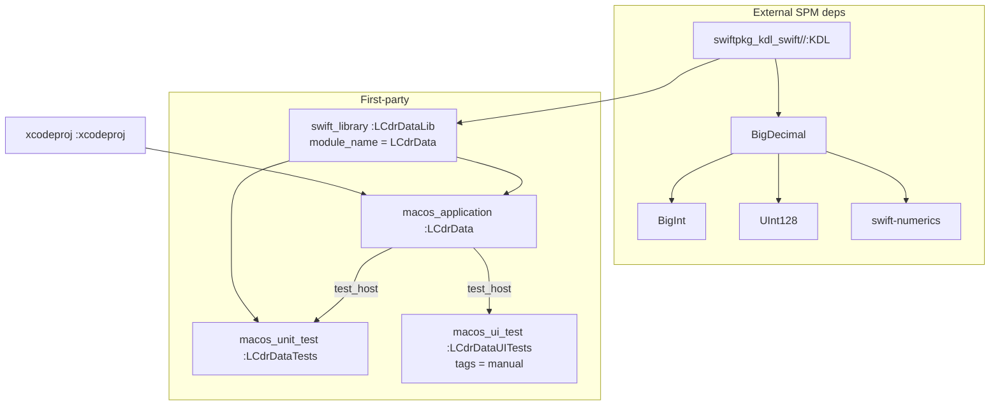
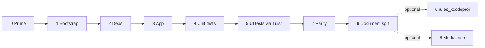

# Bazel Migration Plan

Plan for making **Bazel** (`rules_apple` / `rules_swift`) the build system for
LCdrData, while keeping **Tuist** for the tasks it still does better.

**Goal:** Bazel builds the app and runs the unit tests. That is the definition of
done. Removing Tuist is explicitly *not* a goal.

**Division of labour.** Tuist is retained, permanently, for:

- **Xcode project generation** — `tuist generate` stays the way to get an IDE,
  which keeps SwiftUI previews and the Xcode debugger working exactly as they do
  today.
- **UI tests** — `LCdrDataUITests` runs via Tuist (Phase 5). Bazel's default
  runner cannot drive macOS UI tests at all (see 2.4), and this sidesteps that
  entirely.
- **The SPM manifest** — `Tuist/Package.swift` and `Tuist/Package.resolved` stay
  where they are and become the single dependency source of truth that *both*
  systems read (Phase 2).

Bazel owns building the app, running unit tests, and command-line/CI builds.

This split is what makes the plan low-risk: the two genuinely awkward parts of
Swift-on-Bazel — previews and macOS UI tests — are simply left with the tool that
already handles them.

**Structure:** the app starts as a single `swift_library` that mirrors today's
Tuist target one-to-one. Layered modularisation is a deliberate follow-up
(Phase 8).

---

## 1. Current State

Everything Bazel must reproduce is currently derived by Tuist from
[`Project.swift`](../Project.swift) and [`Tuist/Package.swift`](../Tuist/Package.swift).

| Concern | Today |
|---|---|
| Project generation | `tuist install` + `tuist generate` (`.xcodeproj` gitignored) |
| App target | `LCdrData`, `product: .app`, `com.xvir.LCdrData`, macOS 26.4 |
| Sources | `LCdrData/**` — 46 Swift files, ~7.5k LOC |
| Unit tests | `LCdrDataTests` — 22 files, Swift Testing, hosted in the app |
| UI tests | `LCdrDataUITests` — 4 files, XCTest |
| Resources | `Assets.xcassets`, `Resources/DefaultConfig.kdl` |
| External deps | `KDL` (kdl-swift 2.0.0), `SwiftMocking` (swift-mocking 0.7.1) |
| Info.plist | Generated into `Derived/InfoPlists/` |
| Entitlements | Implicit, from `ENABLE_APP_SANDBOX` family of build settings |
| Signing | `DEVELOPMENT_TEAM = M57JSUC35C` on Release only |

### Verified toolchain

- Bazel **9.2.0** already installed (`/opt/homebrew/bin/bazelisk`)
- Xcode **26.6**, Swift **6.3.3**, macOS SDK **26.4**

---

## 2. Findings That Shape This Plan

These were confirmed by inspecting the tree and the built app bundle. Each one
either removes work or adds a required step.

### 2.1 `SwiftMocking` is dead weight — drop it

`swift-mocking` is declared as a dependency of `LCdrDataTests` but **no test file
imports it**. It pulls in `swift-syntax` 601.0.1 and requires a
`swift_compiler_plugin` macro toolchain — by far the most fragile part of Swift-on-Bazel.

Removing it from `Tuist/Package.swift` before starting eliminates
`swift-syntax` and `xctest-dynamic-overlay` from the dependency graph entirely.
This is a prerequisite, not an optimisation.

> Note: [AGENTS.md](../AGENTS.md) recommends swift-mocking for new mocks. If it is
> genuinely wanted later, reintroduce it as a Bazel `swift_compiler_plugin` in a
> separate change, once the core migration is green.

### 2.2 Tuist's generated Swift sources are unused

`Derived/Sources/TuistAssets+LCdrData.swift` and `TuistBundle+LCdrData.swift`
define `LCdrDataAsset`, `LCdrDataColors`, `LCdrDataResources` and
`Bundle.module`. A search across `LCdrData/`, `LCdrDataTests/` and
`LCdrDataUITests/` finds **zero references** to any of them. No Bazel
equivalent needs to be written.

### 2.3 Entitlements must be authored by hand

`Project.swift` sets `ENABLE_APP_SANDBOX`, `ENABLE_USER_SELECTED_FILES`,
`ENABLE_APP_SANDBOXED_FILES_BOOKMARKS_APP_SCOPE` and `REGISTER_APP_GROUPS`.
These are Xcode-16+ settings that make Xcode *synthesise* an entitlements file.
`rules_apple` has no equivalent — it needs a real `.entitlements` file.

`codesign -d --entitlements` against the current build product shows what is
actually produced:

```xml
<key>com.apple.security.app-sandbox</key>          <true/>
<key>com.apple.security.files.user-selected.read-write</key> <true/>
```

Plus these, which Xcode injects only for **debug/test** builds and which must not
appear in a release build:

```xml
<key>com.apple.security.get-task-allow</key>       <true/>
<key>com.apple.security.temporary-exception.files.absolute-path.read-only</key>
<key>com.apple.security.temporary-exception.mach-lookup.global-name</key>
```

Two useful conclusions:

- `ENABLE_APP_SANDBOXED_FILES_BOOKMARKS_APP_SCOPE` and `REGISTER_APP_GROUPS`
  produce **no entitlement keys at all** — app-scope bookmarks no longer require
  one, and no app groups are declared. The production entitlements file needs
  exactly **two** keys.
- The debug entitlements are what let UI tests attach to the app. A separate
  debug variant, selected with `select()`, is required for the UI-test target.

### 2.4 macOS UI tests will not run under the *default* test runner

`rules_apple`'s documentation for `macos_ui_test` states: *"macOS UI tests are not
currently supported in the default test runner."* So with the stock runner,
`LCdrDataUITests` can be built and can run from Xcode, but `bazel test` will not
execute it.

This is a limitation of that specific runner, not of Bazel or of
`rules_apple`. `macos_test_runner.template.sh` already copies the test bundle and
host app out of the execroot, generates an `.xctestrun`, and invokes
`xcodebuild test-without-building -destination "platform=macOS,..."`, handling
coverage and `.xcresult` bundles along the way. UI tests are turned away by a
hardcoded guard near the top of that script:

```bash
if [[ "%(test_type)s" = "XCUITEST" ]]; then
  echo "This runner only works with macos_unit_test (b/63707899)."
  exit 1
fi
```

`macos_ui_test` exposes a `runner` attribute accepting any target that provides
`AppleTestRunnerInfo`, which is the sanctioned way to supply an alternative
(`rules_idb` uses it to replace only the run phase). A working macOS UI runner
would therefore be a fork of `macos_test_runner.bzl`, its shell template, and its
xctestrun template, with the guard dropped, the UI-test xctestrun keys added
(`IsUITestBundle`, `IsXCTRunnerHostedTestBundle`, `UITargetAppPath`,
`TestHostBundleIdentifier`, `DependentProductPaths` — all present in
`ios_xctestrun_runner.template.xctestrun`), and the XCTRunner host assembly
ported from `ios_xctestrun_runner.template.sh`. The entitlements it needs are the
debug ones from 2.3.

**Not needed, because Tuist keeps running UI tests.** Building the custom runner
would be fiddly bundle-surgery and re-signing work for 4 test files that
[AGENTS.md](../AGENTS.md) already designates manual-only — and macOS UI tests
require a real Aqua login session and granted Accessibility permission, so they
cannot run on a headless CI runner regardless of the build system. Bazel will
`build` them for compile coverage and tag them `manual`; `tuist test` runs them
(Phase 5). Revisit only if UI tests ever need to gate CI.

### 2.5 Unit tests need app-hosted mode

`LCdrDataTests/ConfigurationServiceTests.swift` passes `Bundle.main` into
`ConfigurationService`, which then does
`bundle.url(forResource: "DefaultConfig", withExtension: "kdl")`. For
`Bundle.main` to resolve to a bundle containing that resource, the test must run
inside the app. That means `macos_unit_test(test_host = ":LCdrData")` — the
library-test mode will fail this test.

`@testable import LCdrData` additionally requires `-enable-testing`, which
`rules_swift` enables automatically for `dbg`/`fastbuild` but **not** for
`-c opt`. Tests must not be run in opt mode.

### 2.6 The generated Info.plist contains a bogus key

The generated plist sets `NSMainStoryboardFile = Main`, but the app is pure
SwiftUI with `@main` on `LCdrDataApp` and no storyboard anywhere in the tree.
This is inert Tuist boilerplate. **Do not carry it over** to the hand-written
plist.

### 2.7 `AccentColor` is an empty placeholder

`Assets.xcassets/AccentColor.colorset/Contents.json` declares a universal entry
with no color value. `ASSETCATALOG_COMPILER_GLOBAL_ACCENT_COLOR_NAME` is
therefore a no-op today, and `rules_apple`'s lack of a global-accent-color
attribute is not a parity gap. `AppIcon.appiconset` has one real image
(`icon_512x512@2x.png`) and maps cleanly onto `app_icons`.

---

## 3. Build Setting Translation

The Swift flags were read out of Xcode's `Swift.xcspec` rather than guessed.
`SWIFT_VERSION = 5.0` matters here: `SWIFT_APPROACHABLE_CONCURRENCY` expands to
**five** upcoming features in Swift 5 language mode (in Swift 6 mode it would
only be two).

| Tuist / Xcode setting | `swift_library` copt |
|---|---|
| `SWIFT_VERSION = 5.0` | `-swift-version 5` |
| `SWIFT_DEFAULT_ACTOR_ISOLATION = MainActor` | `-default-isolation=MainActor` |
| `SWIFT_APPROACHABLE_CONCURRENCY = YES` | `-enable-upcoming-feature DisableOutwardActorInference` |
| | `-enable-upcoming-feature GlobalActorIsolatedTypesUsability` |
| | `-enable-upcoming-feature InferIsolatedConformances` |
| | `-enable-upcoming-feature InferSendableFromCaptures` |
| | `-enable-upcoming-feature NonisolatedNonsendingByDefault` |
| `SWIFT_UPCOMING_FEATURE_MEMBER_IMPORT_VISIBILITY = YES` | `-enable-upcoming-feature MemberImportVisibility` |
| `STRING_CATALOG_GENERATE_SYMBOLS` | none needed — no `.xcstrings` in the repo |
| `ENABLE_PREVIEWS` | none — see Phase 6 |
| `ASSETCATALOG_COMPILER_APPICON_NAME` | `macos_application(app_icons = ...)` |
| `ASSETCATALOG_COMPILER_GLOBAL_ACCENT_COLOR_NAME` | no-op, see 2.7 |
| `ENABLE_APP_SANDBOX` family | hand-written `.entitlements`, see 2.3 |
| `DEVELOPMENT_TEAM` (Release) | `provisioning_profile` / `codesignopts` |

Getting `MemberImportVisibility` wrong is the most likely source of a wall of
errors, since the codebase was written under it — a missing `import` that the
flag would have flagged will surface differently.

---

## 4. Target Architecture



The five external repositories are generated automatically by
`rules_swift_package_manager` from the existing `Package.resolved` — they are not
hand-written.

---

## 5. Phases

### Phase 0 — Prune and prepare

1. Remove `swift-mocking` from [`Tuist/Package.swift`](../Tuist/Package.swift) and
   the `SwiftMocking` dependency from the `LCdrDataTests` target in
   [`Project.swift`](../Project.swift). Run `tuist install && tuist generate` and
   confirm `Package.resolved` drops to four pins (kdl-swift, bigdecimal, bigint,
   uint128, swift-numerics) with `swift-syntax` and `xctest-dynamic-overlay` gone.
2. Confirm the Tuist build and unit tests are green *before* touching Bazel, so
   any later failure is unambiguously attributable to Bazel.
3. Capture a reference snapshot of the Tuist-built bundle for the Phase 7 parity
   check: `Contents/Info.plist`, the `codesign -d --entitlements` output, and
   `find LCdrData.app -type f`.

**Exit criteria:** Tuist green, four-package dependency graph, snapshot saved.

### Phase 1 — Bazel workspace bootstrap

New files, all additive:

- `.bazelversion` — pin `9.2.0` to match the installed bazelisk.
- `MODULE.bazel` — bzlmod only; Bazel 9 has removed `WORKSPACE` support.

```starlark
module(name = "lcdrdata", version = "1.0")

bazel_dep(name = "rules_apple", version = "4.5.3", repo_name = "build_bazel_rules_apple")
bazel_dep(name = "rules_swift", version = "3.6.1", repo_name = "build_bazel_rules_swift")
bazel_dep(name = "apple_support", version = "2.8.0", repo_name = "build_bazel_apple_support")
```

- `.bazelrc`:

```
common --enable_platform_specific_config
common --repo_env=DEVELOPER_DIR=/Applications/Xcode.app/Contents/Developer

build --macos_minimum_os=26.4
build --host_macos_minimum_os=26.4

test --test_output=errors

build:release --compilation_mode=opt
```

Pinning `DEVELOPER_DIR` matters: `rules_apple` resolves the SDK from the
selected Xcode, and a silent `xcode-select` change would otherwise invalidate
the whole action cache.

- `.gitignore` — add `bazel-*` (the convenience symlinks) and `MODULE.bazel.lock`
  decision. Recommend **committing** the lock file for reproducible CI.

**Exit criteria:** `bazel mod graph` resolves without error.

### Phase 2 — External dependencies

Add `rules_swift_package_manager`, which reads the *existing* SPM manifest
instead of duplicating dependency declarations:

```starlark
bazel_dep(name = "rules_swift_package_manager", version = "1.23.0")

swift_deps = use_extension("@rules_swift_package_manager//:extensions.bzl", "swift_deps")
swift_deps.from_package(
    resolved = "//Tuist:Package.resolved",
    swift = "//Tuist:Package.swift",
)
use_repo(swift_deps, "swift_deps_info", "swiftpkg_kdl_swift")
```

Pointing at `//Tuist:...` rather than copying the manifests to the repo root
makes `Tuist/Package.swift` the one dependency source of truth that both systems
read — no duplicated version lists that can drift apart. Since Tuist is staying,
this is a permanent arrangement rather than a migration-only measure. It requires
a `Tuist/BUILD.bazel` containing
`exports_files(["Package.swift", "Package.resolved"])`.

The `#if TUIST` block in `Tuist/Package.swift` is inert here — `TUIST` is not
defined when `swift package dump-package` runs, so the `ProjectDescription`
import is skipped.

Run `bazel mod tidy` to let the extension fill in the remaining `use_repo`
names, then verify with:

```bash
bazel build @swiftpkg_kdl_swift//:KDL
```

**Fallback if this fights us:** with `swift-mocking` gone there are only five
packages and no macros, so hand-vendoring them as `http_archive` +
`swift_library` is a tractable plan B. Do not reach for it first.

**Exit criteria:** `KDL` builds standalone under Bazel.

### Phase 3 — App target

New support files under a `Bazel/` directory (keeping generated-looking inputs
out of the source folders):

- `Bazel/Info.plist` — hand-written from the snapshot in Phase 0, **minus**
  `NSMainStoryboardFile`. `rules_apple` supplies `CFBundleExecutable`,
  `CFBundleIdentifier`, `LSMinimumSystemVersion` and the `DT*` keys itself, so
  the file only needs `CFBundleName`, `CFBundleShortVersionString`,
  `CFBundleVersion`, `CFBundlePackageType`, `NSPrincipalClass`,
  `NSHumanReadableCopyright`, `CFBundleDevelopmentRegion`.
- `Bazel/LCdrData.entitlements` — the two production keys from 2.3.
- `Bazel/LCdrData.debug.entitlements` — production keys plus `get-task-allow`
  and the two temporary exceptions, for UI-test builds.

Then `BUILD.bazel` at the repo root:

```starlark
load("@build_bazel_rules_apple//apple:macos.bzl", "macos_application")
load("@build_bazel_rules_swift//swift:swift_library.bzl", "swift_library")

SWIFT_COPTS = [
    "-swift-version", "5",
    "-default-isolation=MainActor",
    "-enable-upcoming-feature", "DisableOutwardActorInference",
    "-enable-upcoming-feature", "GlobalActorIsolatedTypesUsability",
    "-enable-upcoming-feature", "InferIsolatedConformances",
    "-enable-upcoming-feature", "InferSendableFromCaptures",
    "-enable-upcoming-feature", "NonisolatedNonsendingByDefault",
    "-enable-upcoming-feature", "MemberImportVisibility",
]

swift_library(
    name = "LCdrDataLib",
    srcs = glob(["LCdrData/**/*.swift"]),
    module_name = "LCdrData",
    copts = SWIFT_COPTS,
    deps = ["@swiftpkg_kdl_swift//:KDL"],
)

macos_application(
    name = "LCdrData",
    bundle_id = "com.xvir.LCdrData",
    bundle_name = "LCdrData",
    minimum_os_version = "26.4",
    infoplists = ["Bazel/Info.plist"],
    entitlements = "Bazel/LCdrData.entitlements",
    app_icons = glob(["LCdrData/Assets.xcassets/AppIcon.appiconset/**"]),
    resources = [
        "LCdrData/Resources/DefaultConfig.kdl",
        "LCdrData/Assets.xcassets/AccentColor.colorset/Contents.json",
    ],
    deps = [":LCdrDataLib"],
)
```

`module_name = "LCdrData"` is load-bearing — `@testable import LCdrData` in the
test target depends on it.

Two things to verify rather than assume:

- **Resource placement.** `ConfigurationService` looks up `DefaultConfig` at the
  root of the resources directory. Confirm it lands at
  `Contents/Resources/DefaultConfig.kdl` and not in a nested path; if
  `rules_apple` preserves the `Resources/` prefix, switch to an
  `apple_resource_group`.
- **`#Preview` compilation.** Two views (`CommandBarView`, `MainWindowView`) use
  the `#Preview` macro, which loads a macro plugin from the SDK's
  `host/plugins`. If `rules_swift` fails to find it, the fallback is to guard
  both previews with `#if DEBUG` and exclude them from Bazel builds. Only two
  call sites, so the blast radius is small.

**Exit criteria:** `bazel build //:LCdrData` produces a launchable, ad-hoc-signed
`.app`.

### Phase 4 — Unit tests

```starlark
load("@build_bazel_rules_apple//apple:macos.bzl", "macos_unit_test")

swift_library(
    name = "LCdrDataTestsLib",
    testonly = True,
    srcs = glob(["LCdrDataTests/**/*.swift"]),
    module_name = "LCdrDataTests",
    copts = SWIFT_COPTS,
    deps = [":LCdrDataLib"],
)

macos_unit_test(
    name = "LCdrDataTests",
    bundle_id = "com.xvir.LCdrDataTests",
    minimum_os_version = "26.4",
    test_host = ":LCdrData",
    deps = [":LCdrDataTestsLib"],
)
```

`test_host` is required, per 2.5. Confirm the Swift Testing framework
(`Testing.framework`) is linked — `rules_apple` 4.5.x supports Swift Testing, but
this project uses it for *all* 22 unit test files, so a gap here blocks the
phase.

Reconcile the result against `tuist test "LCdrData" --skip-ui-tests`: the same
tests must pass, and the *count* must match. A silently-empty test bundle that
"passes" is the failure mode to watch for.

**Exit criteria:** `bazel test //:LCdrDataTests` passes with a test count equal
to Tuist's.

### Phase 5 — UI tests (compile under Bazel, run via Tuist)

```starlark
macos_ui_test(
    name = "LCdrDataUITests",
    bundle_id = "com.xvir.LCdrDataUITests",
    minimum_os_version = "26.4",
    test_host = ":LCdrData",
    tags = ["manual"],
    deps = [":LCdrDataUITestsLib"],
)
```

Per 2.4 this will not execute under `bazel test`; `tags = ["manual"]` keeps it out
of `bazel test //...`. Use `macos_build_test` to assert it still builds.

The Bazel target exists purely so UI test sources keep compiling in the Bazel
graph — a `bazel build //...` will catch a UI test that no longer builds. It is
never executed by Bazel.

#### `scripts/run-ui-tests.sh`

**Running** UI tests stays with Tuist, which already does it correctly. Wrap it in
a script so it is one command rather than a remembered incantation:

```bash
#!/bin/bash
set -euo pipefail
cd "$(dirname "${BASH_SOURCE[0]}")/.."

# Tuist owns UI test execution: Bazel's default runner cannot drive
# macOS UI tests (see docs/BAZEL_MIGRATION.md 2.4).
if [[ $# -gt 0 ]]; then
    exec tuist test LCdrData --test-targets "LCdrDataUITests/$1"
fi
exec tuist test LCdrData --test-targets LCdrDataUITests
```

Worth adding beyond the bare wrapper:

- **A GUI-session preflight.** Fail with an actionable message if
  `launchctl print gui/$(id -u)` does not succeed. macOS UI tests need a real Aqua
  session, so over SSH or on a headless runner they hang rather than fail cleanly,
  which is a genuinely confusing first encounter.
- **An argument for a single test**, as above, so debugging one failure does not
  mean running all four files:
  `scripts/run-ui-tests.sh PanelSelectionUITests/testFoo`.
- **A note in the script itself** explaining why it shells out to Tuist rather
  than Bazel. Without it, this looks like an oversight to the next reader.

The tradeoff to be aware of: this exercises the **Xcode-built** app, not the
Bazel-built one. UI tests therefore do not validate the Bazel bundle — that job
belongs to the unit tests (Phase 4, which do run against the Bazel-built app) and
to the bundle diff in Phase 7. Given macOS UI tests cannot run headless under any
build system, and the alternative is roughly a hundred lines of XCTRunner bundle
surgery and re-signing for four test files, this is the right trade.

**Exit criteria:** `bazel build //:LCdrDataUITests` succeeds; `bazel test //...`
does not attempt to run it; `scripts/run-ui-tests.sh` runs the suite and reports
pass/fail correctly, verified by deliberately breaking one assertion.

### Phase 6 — Bazel-native Xcode project (optional, not required)

**Not needed for the goal.** Tuist already generates a working Xcode project with
functioning previews, so this phase is an *experiment* to see whether a
Bazel-native project is better — not a step on the critical path. Skipping it
entirely is a perfectly good outcome, and nothing downstream depends on it.

Recorded here so the option is understood rather than rediscovered later.

`rules_xcodeproj` 4.1.0 generates an Xcode project from the Bazel graph:

```starlark
load("@rules_xcodeproj//xcodeproj:defs.bzl", "top_level_target", "xcodeproj")

xcodeproj(
    name = "xcodeproj",
    project_name = "LCdrData",
    tools = { "xcodebuild": "@build_bazel_rules_apple//..." },
    top_level_targets = [
        top_level_target(":LCdrData", target_environments = ["device"]),
        ":LCdrDataTests",
        ":LCdrDataUITests",
    ],
)
```

Be aware before spending time here: `rules_xcodeproj` has an open feature request
(#3201) for SwiftUI preview support, with reported JIT-linking failures on recent
Xcode versions. Previews may simply not work in the generated project.

If Tuist were being removed, that would be the single biggest risk in this plan.
Because it is not, the consequence is merely that this experiment fails: keep
using `tuist generate` and discard the result. The two projects can even coexist,
since Tuist's `.xcodeproj` is gitignored and regenerated on demand.

**Exit criteria:** none. This phase is optional and may be skipped or abandoned
without affecting any other phase.

### Phase 7 — Parity verification

Diff the Bazel-produced bundle against the Phase 0 snapshot:

1. `Info.plist` keys — expect intentional differences only (no
   `NSMainStoryboardFile`; possibly different `DT*` values).
2. `codesign -d --entitlements :-` — the two production keys, and **no**
   `get-task-allow` in a release build.
3. `find LCdrData.app -type f` — `Assets.car`, `DefaultConfig.kdl`, and the app
   binary all present at the same paths.
4. Manual smoke test of the sandbox behaviour, which is the app's most
   entitlement-sensitive area: launch, grant folder access, verify the
   `~`-expansion and bookmark-restore paths described in
   [CONTEXT.md](../CONTEXT.md) still work. An entitlements mistake will not show
   up as a build failure — only as a runtime permission denial.
5. Unit test count and results match Tuist.

**Exit criteria:** documented diff with every remaining difference justified.

### Phase 8 — Layered modularisation (follow-up)

Only after the monolith is green. Split `:LCdrDataLib` along the existing folder
boundaries, which already suggest a layering:

```
App (4 files)  ->  Views (12)  ->  ViewModels (4)  ->  Services (11)  ->  Models (10)
                                                        Utilities (5)
```

Expect real friction: `internal` access currently spans the whole module, so
every cross-layer reference becomes a `public` API decision, and any dependency
cycle between folders must be broken. This is a genuine refactor of the code, not
a build-file change — which is exactly why it is optional and sits outside the
critical path.

Deliver it bottom-up (Models and Utilities first, App last), keeping
`bazel test //...` green at each step. Use `rules_swift`'s
`--features=swift.layering_check_swift` to catch undeclared dependencies.

### Phase 9 — Document the split

Required, and independent of Phase 8 — do it as soon as Phase 7 passes. Nothing
gets deleted here; both toolchains stay. The work is making the boundary obvious,
because an undocumented two-build-system repo is genuinely confusing to walk into.

1. Add a **"Which tool for which task"** section near the top of
   [`AGENTS.md`](../AGENTS.md), stating plainly that Bazel builds and unit-tests,
   Tuist generates the Xcode project and runs UI tests, and that both read
   `Tuist/Package.swift` for dependencies. Note that `CLAUDE.md` is a symlink to
   `AGENTS.md`, so one edit covers both.
2. Update the Build and Test command sections. `bazel build //:LCdrData` and
   `bazel test //:LCdrDataTests` become the documented defaults; the existing
   "during development, only run unit tests" rule maps onto the latter cleanly.
   Point the UI-test section at `scripts/run-ui-tests.sh`.
3. **Keep** the Tuist section — it is still load-bearing for `tuist generate` and
   `tuist install`. Reframe it as "Xcode project generation" rather than "the
   build system", and keep the `.tuist-version` pin documented.
4. Add `MODULE.bazel`, `BUILD.bazel`, `.bazelrc`, `.bazelversion`, `Bazel/` and
   `scripts/` to the Project Structure tree.
5. Update `.gitignore` for `bazel-*`, keeping every existing Tuist entry.

**Exit criteria:** a clean clone can be built and unit-tested with Bazel, and
opened in Xcode with Tuist, following `AGENTS.md` alone.

---

## 6. Risk Register

| Risk | Impact | Mitigation |
|---|---|---|
| SwiftUI previews break under `rules_xcodeproj` | **Retired** | No longer a migration risk — Tuist keeps generating the Xcode project, so previews are untouched. Phase 6 is optional |
| Entitlements mismatch → silent runtime permission failures | **High** | Derived from real `codesign` output, not guessed; explicit Phase 7 manual sandbox smoke test |
| `Bundle.main` resource lookup fails in tests | Medium | `test_host` mode from the start; verify resource path in Phase 3 |
| Swift Testing unsupported or silently empty bundle | Medium | Assert test *count* parity, not just green status |
| `#Preview` macro plugin not found by `rules_swift` | Low | Guard with `#if DEBUG` and exclude |
| `rules_swift_package_manager` mishandles the Tuist-flavoured manifest | Low | Hand-vendor 5 packages as `http_archive` fallback |
| Xcode 26.6 vs. `rules_apple` 4.5.3 SDK edge cases | Low | Bazel 9 support is explicit in the release notes; 5.0.0-rc line available if needed |
| macOS UI tests not runnable via `bazel test` with the default runner | **Retired** | Sidestepped — Tuist runs them via `scripts/run-ui-tests.sh` (Phase 5). A custom Bazel runner remains possible but unnecessary — see 2.4 |
| Two build systems confuse contributors | Low | Phase 9 documents the boundary explicitly in `AGENTS.md`; one shared dependency manifest, no duplication |

## 7. Pinned Versions

| Component | Version |
|---|---|
| Bazel | 9.2.0 |
| `rules_apple` | 4.5.3 |
| `rules_swift` | 3.6.1 |
| `apple_support` | 2.8.0 |
| `rules_swift_package_manager` | 1.23.0 |
| `rules_xcodeproj` | 4.1.0 |

All are the latest stable versions on the Bazel Central Registry as of
2026-08-20, are bzlmod-native, and declare Bazel 9.x LTS compatibility.

Bazel 9.2.0 is the newest stable release and sits on the Active LTS track
(supported until Dec 2028). Bazel 10 exists only as rolling pre-releases, and the
8.8.0 release candidates belong to the older Bazel 8 maintenance track — neither
is a newer choice than 9.2.0.

`rules_apple` has a 5.0.0 release-candidate line and `rules_swift` a 4.0.0 one.
Stay on stable for the migration and treat those major upgrades as separate
changes afterwards.

## 8. Suggested Sequencing

Phases 0-2 are low-risk and independent of the app itself. Phase 3 is the bulk of
the work, and Phase 4 is where "Bazel is the build system" actually becomes true.

The critical path ends at Phase 9. Phase 6 is an optional experiment and Phase 8
an optional refactor; neither is required, and neither blocks anything.


