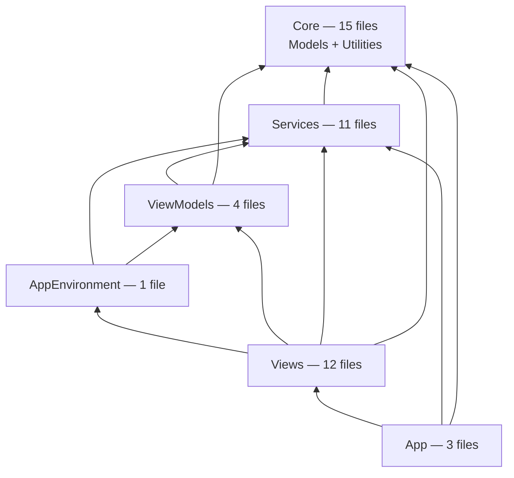

# Phase 8 — Layered Modularisation

Splitting the single `:LCdrDataLib` `swift_library` into layered Bazel modules.

Follow-up to [BAZEL_MIGRATION.md](BAZEL_MIGRATION.md), which deliberately kept the
app as one monolithic target. **Optional.** Nothing depends on this, and the build
is fully working without it.

**Goal:** better incrementality — a change in `Views` should not recompile
`Models`. **Non-goal:** changing behaviour. This is a mechanical refactor; if it
alters runtime behaviour, something has gone wrong.

---

## 1. Is this worth doing?

Be honest about the payoff before starting. The app is ~7.5k lines across 46
files and compiles in roughly 30 seconds from cold. Splitting it into six modules
buys faster incremental builds and enforced layering, at the cost of making 40
types `public` and touching 7 test files.

The stronger argument is architectural rather than performance: right now nothing
*prevents* a `Models` file from calling into `Services`, and one already does (see
§4). Module boundaries make that a compile error instead of a code-review
question.

Skip this if the compile time is not hurting. Do it if you want the layering
enforced.

## 2. Measured current state

Not assumed — extracted by scanning declarations and cross-folder references,
with comment-only lines excluded.

| Folder | Files | Top-level types |
|---|---|---|
| `Models` | 10 | 16 |
| `Utilities` | 5 | 8 |
| `Services` | 11 | 21 |
| `ViewModels` | 4 | 6 |
| `Views` | 12 | 18 |
| `App` | 4 | 8 |

### Cycles found

A naive scan reports five cycles. **Two are false positives** — doc comments that
merely name a type:

- `Models/Command.swift:5` mentions `CommandRunner` in a `///` comment.
- `Services/DirectorySession.swift:10` mentions `AppEnvironment` in a `///` comment.

Any tooling used here must strip comments, or it will send you chasing
dependencies that do not exist.

The three real ones:

| Cycle | Evidence | Resolution |
|---|---|---|
| `Models` ↔ `Utilities` | `Models/CommandCatalog.swift` uses `KeyboardShortcuts`; `Utilities/FileFormatter.swift:41` uses `FileItem` | Merge both into one `Core` module |
| `Models` ↔ `Services` | `Models/FileOperation.swift:20` declares `var progress: FileOperationProgress?`, but `FileOperationProgress` is declared in `Services/FileOperationService.swift:27` | Move that struct into `Core` |
| `App` ↔ `Views` | `App/LCdrDataApp.swift` builds `WindowRootView`; `Views/WindowRootView.swift:9` stores `let env: AppEnvironment` | Extract `AppEnvironment` into its own module below `Views` |

## 3. Target layering



Two placements are non-obvious and were driven by the measurements:

**`Models` and `Utilities` merge into `Core`.** They are mutually dependent, and
untangling them means either relocating `KeyboardShortcuts` into `Models` or
moving `FileFormatter.kind(for:)` out. Merging is 15 files in one leaf module and
eliminates the cycle by construction. Splitting them later is always possible.

**`AppEnvironment` becomes its own module, sitting *above* `ViewModels`.** It
cannot stay in `App`, because `Views/WindowRootView` needs it. It cannot go below
`ViewModels` either, because it holds `weak var mostRecentAppState: AppState?`
(`AppEnvironment.swift:30`) and uses it in `makeFreshSession()`. Its own
dependencies are only `Services` types (`BookmarkStore`, `BookmarkStoreProtocol`,
`ConfigurationService`, `PanelSessionStore`, `SandboxAccessService`), so level 4 is
the one position that satisfies every constraint. Verified that nothing in
`ViewModels` references `AppEnvironment`, so this introduces no new cycle.

Checked against every measured edge, this ordering is acyclic — with exactly one
exception, addressed next.

## 4. The one blocking fix

```swift
// Models/FileOperation.swift:20
var progress: FileOperationProgress?      // declared in Services/FileOperationService.swift:27
```

`FileOperationProgress` is a plain `struct ... : Sendable` value type. It belongs
in `Core` on its own merits, and moving it is the only source change the layering
strictly requires. Do this first, as a standalone commit against the current
monolith — it is valid and reviewable on its own, with no Bazel changes.

After it, the dependency graph is acyclic and the rest is build-file work plus
access-level changes.

## 5. What it costs

### 40 types must become `public`

Every type crossing a module boundary needs `public`, along with the initialisers,
properties and methods used across that boundary. Swift's default `internal` stops
at the module.

| Module | Types needing `public` |
|---|---|
| `Core` | 18 |
| `Services` | 15 |
| `ViewModels` | 4 |
| `Views` | 2 |
| `AppEnvironment` | 1 |

This is the bulk of the work, and it is the part that cannot be automated safely.
Note that `public` on a type is not enough — a `struct` also needs an explicit
`public init`, since the memberwise initialiser stays internal.

Consider `package` instead of `public` where the type should not be API for
anything outside this repo. It behaves like `public` within the package but keeps
the intent legible.

### 7 test files need multiple imports

All 22 test files currently do `@testable import LCdrData`. After the split that
module contains only the App layer.

| Module referenced | Test files |
|---|---|
| `Core` | 13 |
| `Services` | 11 |
| `ViewModels` | 6 |
| `AppEnvironment` | 2 |
| `App` | 1 |

7 files reference more than one module and will need several `@testable import`
lines each. This conflicts with the "one import per line, `@testable` directly
after framework imports" convention in [AGENTS.md](../AGENTS.md) — worth a
decision on ordering before editing 22 files.

Also note `@testable` requires `-enable-testing`, which `rules_swift` enables only
for non-`opt` builds. Tests must not be run under `--config=release`.

## 6. Delivery order

Bottom-up, one module per commit, `bazel test //...` green at every step. Each
step leaves the app building, so it can be abandoned partway without leaving a
mess.

| Step | Action | Verification |
|---|---|---|
| 0 | Move `FileOperationProgress` into `Models`. No Bazel changes | `bazel test //...`, 193 tests |
| 1 | Extract `Core` (Models + Utilities) as a `swift_library`; `:LCdrDataLib` depends on it | 193 tests |
| 2 | Extract `Services` | 193 tests |
| 3 | Extract `ViewModels` | 193 tests |
| 4 | Extract `AppEnvironment` | 193 tests |
| 5 | Extract `Views`; `:LCdrDataLib` is now App-layer only | 193 tests |
| 6 | Update test target deps and `@testable import` lines | 193 tests |
| 7 | Enable layering enforcement | 193 tests, no new warnings |

Keep the app target's `module_name` arrangement in mind: `@testable import
LCdrData` currently resolves because `:LCdrDataLib` sets `module_name =
"LCdrData"`. Step 6 is where that assumption is renegotiated, so expect the test
target to be the fiddliest part.

At step 7, the feature is:

```bash
bazel build //... --features=swift.layering_check
```

**Not** `swift.layering_check_swift`, which does not exist — the only layering
string in rules_swift 3.6.1 is `swift.layering_check`
(`swift/internal/feature_names.bzl`). An earlier draft of the migration plan had
this wrong. Once it passes cleanly, promote it to `.bazelrc` so it is permanent.

## 7. Risks

| Risk | Impact | Mitigation |
|---|---|---|
| `public` churn touches ~40 types and their members | **High effort** | Bottom-up, one module per commit; consider `package` over `public` |
| Test imports fan out across 7 files | Medium | Step 6 is its own commit; decide the import convention first |
| A hidden cycle appears once the compiler enforces boundaries | Medium | Substring scanning is approximate — the compiler is the real authority. Expect at least one surprise |
| Tuist and Bazel diverge | **Medium** | `Project.swift` still defines one flat target. Either mirror the split in Tuist or accept that only Bazel enforces layering — decide explicitly, do not let it drift silently |
| Behaviour changes during a mechanical refactor | Medium | 193 tests at every step; the UI test suite via `scripts/run-ui-tests.sh` before finishing |

The Tuist divergence deserves emphasis. Today both build systems compile the same
flat set of sources. After this, Bazel enforces layering and Tuist does not, so
code that violates a boundary still builds in Xcode and fails in Bazel. That is
tolerable, but only if it is a known trade rather than a surprise.

## 8. Definition of done

- Six `swift_library` targets with explicit `deps`, no cycles.
- `bazel test //...` green: 193 unit tests, plus UI test compile coverage.
- `--features=swift.layering_check` passes with no undeclared-dependency warnings.
- `scripts/run-ui-tests.sh` no worse than before (note
  `PanelSelectionUITests.testClickingEmptySpaceKeepsRowSelected` already fails for
  unrelated, pre-existing reasons).
- A decision recorded on whether `Project.swift` mirrors the split.
