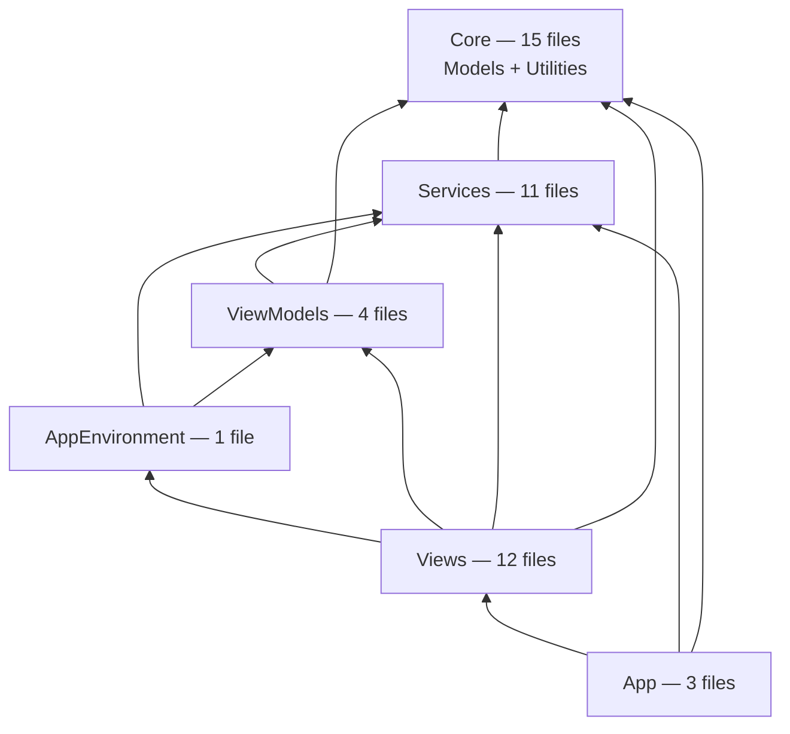

# Phase 8 — Layered Modularisation

Splitting the single `:LCdrDataLib` `swift_library` into layered Bazel modules.

Follow-up to [BAZEL_MIGRATION.md](BAZEL_MIGRATION.md), which deliberately kept the
app as one monolithic target. **Optional.** Nothing depends on this, and the build
is fully working without it.

**Goal:** better incrementality — a change in `Views` should not recompile
`Models`. **Non-goal:** changing behaviour. This is a mechanical refactor; if it
alters runtime behaviour, something has gone wrong.

---

## 1. Is this worth doing?

Be honest about the payoff before starting. The app is ~7.5k lines across 46
files and compiles in roughly 30 seconds from cold. Splitting it into six modules
buys faster incremental builds and enforced layering, at the cost of making 40
types `public` and touching 7 test files.

The stronger argument is architectural rather than performance: right now nothing
*prevents* a `Models` file from calling into `Services`, and one already does (see
§4). Module boundaries make that a compile error instead of a code-review
question.

Skip this if the compile time is not hurting. Do it if you want the layering
enforced.

## 2. Measured current state

Not assumed — extracted by scanning declarations and cross-folder references,
with comment-only lines excluded.

| Folder | Files | Top-level types |
|---|---|---|
| `Models` | 10 | 16 |
| `Utilities` | 5 | 8 |
| `Services` | 11 | 21 |
| `ViewModels` | 4 | 6 |
| `Views` | 12 | 18 |
| `App` | 4 | 8 |

### Cycles found

A naive scan reports five cycles. **Two are false positives** — doc comments that
merely name a type:

- `Models/Command.swift:5` mentions `CommandRunner` in a `///` comment.
- `Services/DirectorySession.swift:10` mentions `AppEnvironment` in a `///` comment.

Any tooling used here must strip comments, or it will send you chasing
dependencies that do not exist.

The three real ones:

| Cycle | Evidence | Resolution |
|---|---|---|
| `Models` ↔ `Utilities` | `Models/CommandCatalog.swift` uses `KeyboardShortcuts`; `Utilities/FileFormatter.swift:41` uses `FileItem` | Merge both into one `Core` module |
| `Models` ↔ `Services` | `Models/FileOperation.swift:20` declares `var progress: FileOperationProgress?`, but `FileOperationProgress` is declared in `Services/FileOperationService.swift:27` | Move that struct into `Core` |
| `App` ↔ `Views` | `App/LCdrDataApp.swift` builds `WindowRootView`; `Views/WindowRootView.swift:9` stores `let env: AppEnvironment` | Extract `AppEnvironment` into its own module below `Views` |

## 3. Target layering



Two placements are non-obvious and were driven by the measurements:

**`Models` and `Utilities` merge into `Core`.** They are mutually dependent, and
untangling them means either relocating `KeyboardShortcuts` into `Models` or
moving `FileFormatter.kind(for:)` out. Merging is 15 files in one leaf module and
eliminates the cycle by construction. Splitting them later is always possible.

**`AppEnvironment` becomes its own module, sitting *above* `ViewModels`.** It
cannot stay in `App`, because `Views/WindowRootView` needs it. It cannot go below
`ViewModels` either, because it holds `weak var mostRecentAppState: AppState?`
(`AppEnvironment.swift:30`) and uses it in `makeFreshSession()`. Its own
dependencies are only `Services` types (`BookmarkStore`, `BookmarkStoreProtocol`,
`ConfigurationService`, `PanelSessionStore`, `SandboxAccessService`), so level 4 is
the one position that satisfies every constraint. Verified that nothing in
`ViewModels` references `AppEnvironment`, so this introduces no new cycle.

Checked against every measured edge, this ordering is acyclic — with exactly one
exception, addressed next.

## 4. The one blocking fix

```swift
// Models/FileOperation.swift:20
var progress: FileOperationProgress?      // declared in Services/FileOperationService.swift:27
```

`FileOperationProgress` is a plain `struct ... : Sendable` value type. It belongs
in `Core` on its own merits, and moving it is the only source change the layering
strictly requires. Do this first, as a standalone commit against the current
monolith — it is valid and reviewable on its own, with no Bazel changes.

After it, the dependency graph is acyclic and the rest is build-file work plus
access-level changes.

## 5. What it costs

### 40 types must become `public`

Every type crossing a module boundary needs `public`, along with the initialisers,
properties and methods used across that boundary. Swift's default `internal` stops
at the module.

| Module | Types needing `public` |
|---|---|
| `Core` | 18 |
| `Services` | 15 |
| `ViewModels` | 4 |
| `Views` | 2 |
| `AppEnvironment` | 1 |

This is the bulk of the work, and it is the part that cannot be automated safely.
Note that `public` on a type is not enough — a `struct` also needs an explicit
`public init`, since the memberwise initialiser stays internal.

Consider `package` instead of `public` where the type should not be API for
anything outside this repo. It behaves like `public` within the package but keeps
the intent legible.

### 7 test files need multiple imports

All 22 test files currently do `@testable import LCdrData`. After the split that
module contains only the App layer.

| Module referenced | Test files |
|---|---|
| `Core` | 13 |
| `Services` | 11 |
| `ViewModels` | 6 |
| `AppEnvironment` | 2 |
| `App` | 1 |

7 files reference more than one module and will need several `@testable import`
lines each. This conflicts with the "one import per line, `@testable` directly
after framework imports" convention in [AGENTS.md](../AGENTS.md) — worth a
decision on ordering before editing 22 files.

Also note `@testable` requires `-enable-testing`, which `rules_swift` enables only
for non-`opt` builds. Tests must not be run under `--config=release`.

## 6. Reorganise the tests into per-module targets

`LCdrDataTests/` is currently **flat** — 22 files, no subdirectories — while the
app target is organised into seven folders. Nothing requires that: a Swift module
is a flat namespace, so directory layout has no effect on visibility or imports,
and **both build systems already glob recursively**
(`glob(["LCdrDataTests/**/*.swift"])` and `sources: ["LCdrDataTests/**"]`). Adding
folders needs no build-file change at all.

Group the tests by **module**, not by the app's current folders — `Models` and
`Utilities` tests merge into `Core/`, mirroring the module merge in §3:

```
LCdrDataTests/
├── Core/             8 files   Models (6) + Utilities (2)
├── Services/         7 files   6 + FileSystemServiceTests
├── ViewModels/       5 files   4 + PanelViewModelPhase3Tests
├── AppEnvironment/   1 file    AppEnvironmentTests
└── App/              1 file    AppDelegateTests
```

That accounts for all 22 files (8 + 7 + 5 + 1 + 1). Two need placing by hand
rather than by filename: `FileSystemServiceTests` belongs in `Services/`, and
`PanelViewModelPhase3Tests` in `ViewModels/` — name-based grouping mis-sorts the
latter into `Models/` because no `PanelViewModelPhase3` type exists.

Then one `macos_unit_test` per folder:

```starlark
swift_library(
    name = "CoreTestsLib",
    testonly = True,
    srcs = glob(["LCdrDataTests/Core/**/*.swift"]),
    copts = SWIFT_COPTS,
    module_name = "CoreTests",
    deps = [":Core"],
)

macos_unit_test(
    name = "CoreTests",
    bundle_id = "com.xvir.LCdrData.CoreTests",   # must be unique per target
    minimum_os_version = "26.4",
    tags = ["local"],
    test_host = ":LCdrData",
    deps = [":CoreTestsLib"],
)
```

### Things that will bite

**No shared test helpers — verified.** Every test double (`FakeBookmarkStore`,
`MockFileSystemService`, `StubHomeDirectoryProvider`, `FakePanelSessionStore`,
`FakeBookmarkSerializer`, `FakeAccessPresenter`, `MockFileOperationService`) is
used *only* in the file that declares it. So no shared `TestSupport` library is
needed, and the split cannot break a cross-file helper. Re-check this if new tests
are added before the split happens.

**Test count parity becomes a sum.** Today the check is a single
`Test run with 193 tests`. Afterwards each target reports its own subtotal and
**193 is the sum across five targets**. Anyone comparing a single target's output
against 193 will think tests vanished. Update the guidance in
[AGENTS.md](../AGENTS.md) at the same time.

**Bundle IDs must be unique.** Five targets sharing `com.xvir.LCdrDataTests` is a
recipe for confusing runner failures. Suffix per target as above.

**Exactly one test needs an app host, and it is not the one you would expect.**
Measured, not assumed: with `test_host` and `tags = ["local"]` both removed,
**192 of 193 tests pass**. The single failure is `trashFile()`:

```
✘ trashFile() — "trash_me.txt" couldn't be moved to the trash because you
  don't have permission to access it.
  afpAccessDenied: Insufficient access privileges for operation
```

`FileManager.trashItem` needs an application context that the bare `xctest`
runner does not provide. Nothing else in the suite does.

This corrects finding 2.5 in [BAZEL_MIGRATION.md](BAZEL_MIGRATION.md), which
claimed `test_host` was required because `ConfigurationServiceTests` reads
`Bundle.main`. That inferred a dependency from the *presence* of `Bundle.main` in
the source without checking whether it is ever dereferenced — and it is not:

- `ConfigurationServiceTests` passes `defaultKDLTextOverride: sampleDefaultKDL`,
  and `defaultKDLText()` returns the override before touching `bundle`. Its
  `bundle: Bundle.main` argument is **vestigial**.
- `BookmarkStoreTests` and `PanelSessionStoreTests` already inject
  `UserDefaults(suiteName:)` and never touch `.standard`.

So injection has *already* solved the `Bundle` and `UserDefaults` concerns. The
options for the one genuine holdout are:

| Option | Trade |
|---|---|
| Keep `test_host` on all targets (status quo) | Simplest; every target pays the debug entitlements and the `local` tag |
| App-host only `ServicesTests`; library-test the other four | Four targets get faster and simpler; one boundary to remember |
| Inject a `TrashServicing` protocol and mock it | Removes the last app-host need, but the test then verifies *that a call was made* rather than that trashing works — losing real coverage of a destructive operation |

Mocking the trash call is possible but is the weakest of the three: it trades
genuine verification of an irreversible file operation for build convenience. Prefer
one of the first two.

Whichever is chosen, drop `test_host` target by target and keep the change only
where the tests still pass — `rules_apple` warns that library tests run outside an
application context, and `trashFile()` is proof that the warning has teeth.

**There are no `Views` tests.** All 12 files in `LCdrData/Views/` are untested;
the three test files with "View" in the name are ViewModel tests. So there is no
`ViewsTests` target to create — worth knowing rather than hunting for the missing
folder.

### Do this before the module split

The reorganisation is a pure `git mv` with **no build-file change**, so it is
independently valuable and independently revertible. Doing it first turns step 6
of the delivery order from "rewire 22 files' imports inside one target" into "give
five already-grouped targets one obvious dependency each".

## 7. Delivery order

Bottom-up, one module per commit, `bazel test //...` green at every step. Each
step leaves the app building, so it can be abandoned partway without leaving a
mess.

| Step | Action | Verification |
|---|---|---|
| 0 | Move `FileOperationProgress` into `Models`. No Bazel changes | `bazel test //...`, 193 tests |
| 0b | Reorganise `LCdrDataTests/` into per-module folders (§6). Pure `git mv`, no Bazel changes | 193 tests, still one target |
| 1 | Extract `Core` (Models + Utilities) as a `swift_library`; `:LCdrDataLib` depends on it | 193 tests |
| 2 | Extract `Services` | 193 tests |
| 3 | Extract `ViewModels` | 193 tests |
| 4 | Extract `AppEnvironment` | 193 tests |
| 5 | Extract `Views`; `:LCdrDataLib` is now App-layer only | 193 tests |
| 6 | Split the single test target into five per-module `macos_unit_test` targets (§6); fix `@testable import` lines | **Sum** of five targets = 193 |
| 7 | Verify layering enforcement (already provided by `deps` + `MemberImportVisibility`) | A lower layer importing an upper one fails to build |
| 8 | Split the root `BUILD.bazel` into per-package BUILD files (§9) | Counts sum to 193; a visibility violation fails analysis |
| 9 | Give each test folder its own BUILD file too, `Core` splitting into `Models` and `Utilities` (§9, last subsection) | Counts sum to 193; production visibility lists narrow |

Keep the app target's `module_name` arrangement in mind: `@testable import
LCdrData` currently resolves because `:LCdrDataLib` sets `module_name =
"LCdrData"`. Step 6 is where that assumption is renegotiated, so expect the test
targets to be the fiddliest part.

From step 6 onward `bazel test //...` reports **six** test targets — five unit
test targets plus `//:LCdrDataUITests_build_test` — and no single one of them
reports 193.

### Step 7: layering is already enforced, and the feature does not help

`swift.layering_check` exists in rules_swift 3.6.1 but is wired **only** to
`SWIFT_ACTION_PRECOMPILE_C_MODULE` — it checks *Clang* module layering, not
Swift. Confirmed by `bazel aquery`: passing the feature adds no flags to the
Swift compile action, and it triggers no recompilation. This project has no C
modules, so it is a no-op.

The Swift-specific variant, `swift.layering_check_swift`, landed in
**rules_swift 4.0** and is not in 3.6.1. Both earlier drafts of this plan named
the wrong flag.

Enforcement is nevertheless already in place, by two independent mechanisms:

- **Explicit Bazel `deps`.** A module can only import what its `deps` declare.
  Verified by adding `import Views` to `Core/Models/Cursor.swift`, which fails
  with `error: no such module 'Views'`. This is the layering constraint, and it is
  a hard build error rather than a warning.
- **`MemberImportVisibility`.** Already enabled project-wide. A member is
  unusable without importing its defining module, so a symbol cannot leak in
  transitively. This was visible during steps 1 and 2, where it forced imports on
  files whose only use of a module was through its members.

Between them, the goal of step 7 is met. Revisit `swift.layering_check_swift`
when upgrading to rules_swift 4.0, where it would additionally catch *declared
but unused* dependencies — the one gap the two mechanisms above leave open.

## 8. Risks

| Risk | Impact | Mitigation |
|---|---|---|
| `public` churn touches ~40 types and their members | **High effort** | Bottom-up, one module per commit; consider `package` over `public` |
| Test imports fan out across 7 files | Medium | Reorganise the test folders first (step 0b), so step 6 wires five grouped targets instead of rewriting 22 scattered imports |
| Per-target test counts mistaken for lost tests | Low | 193 becomes a sum across five targets; update the count guidance in `AGENTS.md` in the same commit |
| A hidden cycle appears once the compiler enforces boundaries | Medium | Substring scanning is approximate — the compiler is the real authority. Expect at least one surprise |
| Tuist and Bazel diverge | **Medium** | `Project.swift` still defines one flat target. Either mirror the split in Tuist or accept that only Bazel enforces layering — decide explicitly, do not let it drift silently |
| Behaviour changes during a mechanical refactor | Medium | 193 tests at every step; the UI test suite via `scripts/run-ui-tests.sh` before finishing |

The Tuist divergence deserves emphasis. Today both build systems compile the same
flat set of sources. After this, Bazel enforces layering and Tuist does not, so
code that violates a boundary still builds in Xcode and fails in Bazel. That is
tolerable, but only if it is a known trade rather than a surprise.

## 9. Per-package BUILD files (step 8)

Every module is currently defined in the **root** `BUILD.bazel`. That is not a
design decision — the migration carved modules out of a pre-existing monolithic
target, and leaving the definitions where that target already lived was the
smallest change per step. Per-directory BUILD files are the idiomatic Bazel
layout.

### Why it is worth doing: visibility becomes real enforcement

Bazel `visibility` only applies **across** packages. With everything in one
package it does nothing, because targets in the same package can always see each
other. Split into packages, each module can name exactly who may depend on it:

```starlark
# LCdrData/Services/BUILD.bazel
swift_library(
    name = "Services",
    visibility = [
        "//LCdrData/ViewModels:__pkg__",
        "//LCdrData/Views:__pkg__",
        "//LCdrData/App:__pkg__",
    ],
)
```

A `Core` → `Services` dependency then fails at **analysis time**, which is
strictly stronger than step 7's `swift.layering_check`. Since the case for this
whole phase rests on enforced layering rather than build speed (§1), that is a
material upgrade rather than housekeeping.

### The blocker: two modules do not map to directories

A Bazel package covers its own directory plus subdirectories without their own
BUILD file. It **cannot** glob into a sibling directory.

| Module | Sources | Per-package feasible? |
|---|---|---|
| `Core` | `Models/**` + `Utilities/**` | **No** — two sibling directories |
| `Services` | `Services/**` | Yes |
| `ViewModels` | `ViewModels/**` | Yes |
| `Views` | `Views/**` | Yes |
| `AppEnvironment` | `App/AppEnvironment.swift` | Yes — one BUILD file can define two targets |
| `App` | `App/**` minus that file | Yes, same package as above |

Only `Core` is genuinely blocked. Fixing it means making the directory layout
match the module layout — moving `Models/` and `Utilities/` under
`LCdrData/Core/` — which also updates the Tuist source globs.

### Why step 8 and not step 0

Deliberately sequenced last. Restructuring directories mid-extraction would aim
the remaining steps at a moving target, and step 5 in particular has to carve
`App/` into two modules, which is easier to reason about before directories move.

### Two output-path collisions to expect

Bazel forbids one action's output path being a prefix of another's, and macOS
filesystems are case-insensitive by default. Both bite here:

- **An app target named `LCdrData` in the repo root collides with the
  `LCdrData/` package subtree** — `bin/LCdrData` is a prefix of
  `bin/LCdrData/Core/...`. Fix: move the app target *into* the `LCdrData`
  package, so its output is `bin/LCdrData/<name>`.
- **Naming that target `app` then collides with the `App/` layer package** —
  `bin/LCdrData/app` and `bin/LCdrData/App/` are the same path when case is
  ignored. Fix: name the target for its package, giving `//LCdrData`, which also
  reads better than `//LCdrData:app`.

`bundle_name = "LCdrData"` keeps the product `LCdrData.app` regardless of the
target name, so neither rename affects the shipped artifact.

### The test tree gets the same treatment (step 9)

Step 8 left `LCdrDataTests/` as a single package holding all six test targets.
Because the test folders already mirror the module layout (§6), each becomes a
package with no source moves at all — only the BUILD file is split six ways, and
`LCdrDataTests/BUILD.bazel` disappears entirely since no sources sit at that
level. `bazel test //LCdrDataTests/...` is unaffected.

Test targets are named for their package, matching the app target's convention,
so a single module's tests run as `bazel test //LCdrDataTests/Services` rather
than `//LCdrDataTests:ServicesTests`. Swift module names keep the `Tests` suffix
(`module_name = "ServicesTests"`), as do the bundle IDs.

The payoff is the same as for production modules: visibility stops being a
subtree-wide grant. `ViewModels` was previously visible to `//LCdrDataTests` as a
whole; it is now visible to the two test packages that actually import it, and
`AppEnvironment` to three. Verified by pointing the `Core` tests at `ViewModels`,
which fails with `Visibility error`.

One dependency turned out to be unnecessary and was dropped: the `Core` tests
never imported `TestSupport`.

The test tree also splits **one level deeper than production**. `Core` has to be
a single module because `Models` and `Utilities` are mutually dependent (§9), but
its tests are not — nothing in `Core/Models` imports `Core/Utilities` or the
reverse — so each is its own package and its own `macos_unit_test`:
`//LCdrDataTests/Core/Models` (50 tests) and `//LCdrDataTests/Core/Utilities`
(18). That makes seven test targets in `bazel test //...` including UI test
compile coverage.

This is where the tightened visibility earns its keep. Neither `Core` test
package appears in `//LCdrData/Services`'s visibility list, so an `import
Services` in a test for the bottom layer fails at analysis time instead of
quietly widening the graph. All eight files carried exactly that import, unused
— a leftover from when the tests were one flat target — with one real exception:
four tests in `Core/Models/FileOperationTests.swift` covered
`FileOperationError`, which is declared in `Services/FileOperationService.swift`.
They moved to `LCdrDataTests/Services/FileOperationServiceTests.swift`, beside
the type they test, which is why `Models` reports 50 rather than the 54 implied
by the old `CoreTests` total of 72 and `Services` reports 46 rather than 42.

That is the general shape of the answer whenever a test target wants a
dependency its layer should not have: the test is usually filed in the wrong
place, and moving it is preferable to widening the visibility list or splitting
the library in two.

## 10. Definition of done

- Six `swift_library` targets with explicit `deps`, no cycles.
- Six per-module `macos_unit_test` targets, each with a unique `bundle_id`, whose
  counts **sum** to 193.
- `bazel test //...` green across all seven test targets, including UI test compile
  coverage.
- `--features=swift.layering_check` passes with no undeclared-dependency warnings.
- `scripts/run-ui-tests.sh` no worse than before (note
  `PanelSelectionUITests.testClickingEmptySpaceKeepsRowSelected` already fails for
  unrelated, pre-existing reasons).
- A decision recorded on whether `Project.swift` mirrors the split.
