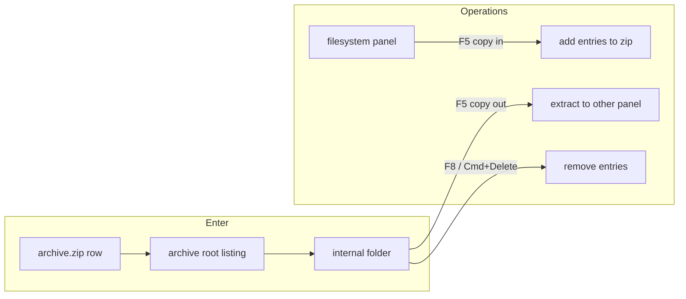

# Browse ZIP Archives as Folders

Treat `.zip` files as enterable locations: list and navigate their contents like a directory, extract on copy-out, pack on copy-in, and remove entries on delete — without restoring an in-archive location after relaunch.

[DESIGN.md](../DESIGN.md) already names this as **archive browsing** (currently under "Not in scope yet"). **Decided:** a zip is an **archive** — a file whose contents are browsed as **locations**. Copy out unpacks, copy in packs (when the archive is writable), delete removes the entry. Zip only. A relaunch must land in the **directory** that contains the archive, never inside it.

Today every panel location is a real `file://` directory ([`PanelState.currentDirectory`](../../LCdrData/Core/Models/PanelState.swift), [`FileSystemService.listDirectory`](../../LCdrData/Services/FileSystemService.swift), [`FileOperationService`](../../LCdrData/Services/FileOperationService.swift) via `FileManager`). Entering a zip cannot reuse that path unchanged.



## Implementation order

1. Models (`BrowseLocation`, FileItem identity) + tests, with `PanelState` still filesystem-only until the service exists.
2. `ArchiveService` + ZIPFoundation + listing/extract/add/remove tests.
3. Wire enter/leave/list/watch/path bar (read-only browsing).
4. Copy-out, copy-in, delete, mkdir, rename, drop, drag, Quick Look/F4 temp extract.
5. Read-only archive behaviour and command enablement; zip-slip / 4 GB + free-space extract guards.
6. Persist containing directory only; [DESIGN.md](../DESIGN.md) + [CURRENT_ARCH.md](../CURRENT_ARCH.md) ([CONTEXT.md](../CONTEXT.md) and [ADR-0001](../adr/0001-virtual-archive-locations.md) already written).

---

## 1. Location model

**Decided:** a panel browses a **location**, not always a directory. A **directory** is a real filesystem folder; an archive interior is a location, not a directory. Glossary: [CONTEXT.md](../CONTEXT.md).

Swift type will likely be named `BrowseLocation` so Models does not own a meaningless `Location`. Store it on `PanelState` instead of (or wrapping) `currentDirectory`:

```swift
package enum BrowseLocation: Hashable, Sendable {
    case directory(URL)
    case zipArchive(container: URL, internalPath: String) // "" at archive root
}
```

`FileItem` stays the listing row for both filesystem entries and archive interiors (identity keyed on `"file:"` / `"parent:"` / `"zip:" + container.path + "!" + internalPath`). Do not split out a second row type.

- `parent` of archive root → the containing folder (so `..`, `⌘↑`, and Delete leave the zip).
- `parent` of an internal folder → the parent internal path (or archive root).
- `persistentDirectory` → always a real folder: for a zip location, `container.deletingLastPathComponent()`. This is what session restore writes.
- `watchURL` → the zip file itself (DirectorySession already opens an `O_EVTONLY` FD; that works on a file).
- Display path for the path bar → `/Users/me/Docs/archive.zip/folder`.

Rejected: fake nested file URLs (`…/archive.zip/folder` as a `file://` path) — every FileManager/bookmark/drop call becomes a footgun. Rejected as the listing model: extract-the-whole-zip to temp (kept only as a tactic for Quick Look / F4 / drag-out of a single member).

---

## 2. ZIP I/O

**Decided:** virtual listing — read the zip index, synthesize folder rows, extract only on copy-out / preview / drag. Not a full extract to temp, not fake `file://` paths. ADR: [0001-virtual-archive-locations.md](../adr/0001-virtual-archive-locations.md).

Library: **Decided:** ZIPFoundation in [`Tuist/Package.swift`](../../Tuist/Package.swift), behind `ArchiveServiceProtocol` in Services. Rejected: `/usr/bin/ditto` for per-entry updates; hand-rolled ZIP.

Listing must **synthesize folder rows** from entry prefixes. Many zips store `folder/file.txt` with no `folder/` directory entry. **Decided:** Size shows **uncompressed** size (what copy-out will write). Kind for the zip *file* in a parent listing stays `ZIP`; inside, folders are folders.

**Decided:** detect zip by case-insensitive `.zip` extension and `!isDirectory`. A real directory named `foo.zip` remains a directory. Do not sniff `PK\x03\x04` in this slice.

---

## 3. Entering and leaving

**Decided:** an archive is **enterable** but is not a directory. Return / `⌘↓` / double-click / context-menu Open enter it. `F2` still renames the zip file. `F4` on the zip row in the parent directory still opens Archive Utility.

- Keep `isDirectory == false` (size, kind, icon stay file-like).
- Add an `isEnterable` predicate (directory, symlink-to-directory, or archive). Do not widen `isNavigableDirectory` to cover archives.
- `..` at archive root goes to the containing directory and lands the cursor on the zip (`Cursor.Intent.landOnChild`), same as leaving a real directory.

**Decided:** a zip inside a zip is a file, not enterable. Copy it out to work with it. Location stays one archive file plus an internal path — not a stack.

**Decided:** breadcrumbs show `/Users/…/Downloads/photos.zip/vacation` (`archive.zip` is a clickable segment). Clicking `photos.zip` goes to archive root; clicking the parent directory leaves the archive. Cmd+L in this slice still only accepts real directories. Copy-path copies the display string.

**History:** in-memory back/forward may include archive locations. History is not persisted across launches today — leave that as-is.

**Decided:** while inside an archive, `DirectorySession` watches the **zip file**. Debounced reload with `.keepSelection`. Our own rewrite will bounce the watcher; that is acceptable.

---

## 4. File operations

Route in `FileOperationService` (or a thin coordinator it owns) from **source location × destination location**, so [`FileOperationViewModel`](../../LCdrData/ViewModels/FileOperationViewModel.swift) keeps doing dialogs/progress and does not grow format knowledge.

**Decided:** F5 Copy and F6 Move both work filesystem ↔ archive and archive ↔ archive (Move = Copy then remove source). Unpack/pack is the mechanism, not a new command.

| From → To | Copy (F5) | Move (F6) |
| --- | --- | --- |
| FS → FS | existing `FileManager` | existing |
| Zip → FS | extract selected entries (files and folder prefixes) into the dest directory | extract, then remove those entries |
| FS → Zip | add entries at the current internal path | add, then trash/delete the sources |
| Zip → Zip | extract to a temp file, then add (or copy compressed entries if the library allows) | copy then remove from source |

Delete:

- **Decided:** inside an archive, F8 and `⌘⌫` both **delete from the archive** (with confirmation “Delete from archive”). Finder Trash is not used.
- **Decided:** Reveal in Finder is disabled inside an archive.
- **Decided:** drop onto an archive-backed panel packs (same path as copy-in), not `FileManager.copyItem` (today’s [`handleExternalFileDrop`](../../LCdrData/Views/FileTableView.swift) is FS-only).
- **Decided:** drag-out, Quick Look, and F4 on an archive member extract that one file to a per-window temp directory, then use the existing `NSItemProvider` / `QLPreviewPanel` / `NSWorkspace.open`. Delete the temp tree when the panel leaves the archive and on terminate.
- **Decided:** F7 / F2 inside an archive work: mkdir adds a folder entry; rename rewrites names/prefixes.
- Conflicts (overwrite / skip / rename / apply to all) reuse the existing dialog. Destination existence for zip means “an entry with that name already exists at this internal path.”
- Progress overlay already exists for copy/move; use it for extract/pack, including large rewrites.
- **Decided:** serialize mutations per archive file so two rewrites cannot clobber each other; reload every panel whose location is that archive.
- **Decided:** copy-out refuses paths that would leave the destination directory (zip-slip). Zip-bomb: refuse if claimed uncompressed size of the batch exceeds free space; abort if written bytes exceed the claim; 4 GB per-member hard cap.

---

## 5. Read-only archives

**Decided:** do not use the word locked. An archive you cannot write to is **read-only** (permissions, read-only volume, or encrypted). Enter and copy-out still work; copy-in, move-in, mkdir, rename, and delete are disabled with “The archive is not writable.”

- If the archive cannot be listed (corrupt, not actually zip): do not enter; stay in the parent directory and surface the error.
- Encrypted members: listing may work; copy-out of those rows fails with a clear error.
- Do not flock the zip; macOS generally allows concurrent readers.

---

## 6. Session restore (required)

[`WindowRootView`](../../LCdrData/Views/WindowRootView.swift) currently writes `newURL.path` into `PanelSession` on every navigation, and [`AppEnvironment.makeFreshSession`](../../LCdrData/App/AppEnvironment.swift) / [`PanelSessionStore`](../../LCdrData/Services/PanelSessionStore.swift) replay those paths.

**Decided:** persist the containing **directory** only — never an archive-internal path and never the zip file. Next launch both panels open in real directories. Live `⌘N` still clones the frontmost window’s in-memory location, including inside an archive.

Do not save security-scoped bookmarks for archive-internal URLs. Coverage of the containing folder already grants access to the zip.

---

## 7. Module and call-site impact

- **Models:** `BrowseLocation`, `FileItem` location/identity, possibly `FileOperationType` taking locations instead of raw URLs.
- **Services:** `ArchiveServiceProtocol` + ZIPFoundation-backed type; listing dispatch (filesystem vs zip) either inside `FileSystemService` or a small facade `PanelViewModel` already talks to; operation routing; `DirectorySession` pointed at `watchURL`.
- **ViewModels:** `openItem` / Return treat zip as enterable; `navigateToParent` uses `BrowseLocation.parent`; session-facing APIs expose `persistentDirectory`.
- **Views:** path bar breadcrumbs from display path; drop/drag; command enablement; confirmation strings; archive icon optional (`doc.zipper` vs `doc`).
- **AppEnvironment / WindowRootView:** persist collapsed paths; do not bookmark fake URLs.
- **Docs:** move archive browsing out of “Not in scope yet” in [DESIGN.md](../DESIGN.md); snapshot the new service in [CURRENT_ARCH.md](../CURRENT_ARCH.md). Glossary and ADR are already written: [CONTEXT.md](../CONTEXT.md), [0001-virtual-archive-locations.md](../adr/0001-virtual-archive-locations.md).

Layering: ZIPFoundation is a Services dependency only, same pattern as `kdl-swift`.

---

## 8. Tests (Bazel unit tests only)

- `ArchiveService`: list (explicit and implicit folders), extract one file and a folder prefix, add, remove, mkdir, rename prefix, encrypted/unreadable zip, non-writable file.
- `BrowseLocation`: parent, display path, `persistentDirectory` collapse.
- `FileItem` identity for zip entries vs filesystem files vs `..`.
- `PanelViewModel`: enter zip, leave via `..` lands on the zip, history back, hidden-files filter inside zip.
- `FileOperationViewModel` / service routing: zip→FS extract, FS→zip pack, delete-from-zip, read-only write fails, drop path.
- Session: saving while inside a zip stores the containing folder.

Hand-written fakes of `ArchiveServiceProtocol`, no extra mocking framework. Zip fixtures built in temp with ZIPFoundation (or a tiny committed fixture).

---

## 9. Explicitly out of this slice

Password prompt; tar / 7z / rar; entering a zip that lives inside a zip; extension-less zip sniffing; spanned/split zips; Cmd+L parsing of `archive.zip/internal` paths.

Follow-up work that this slice left unfinished lives in [zip-as-folders-leftovers.md](zip-as-folders-leftovers.md).
